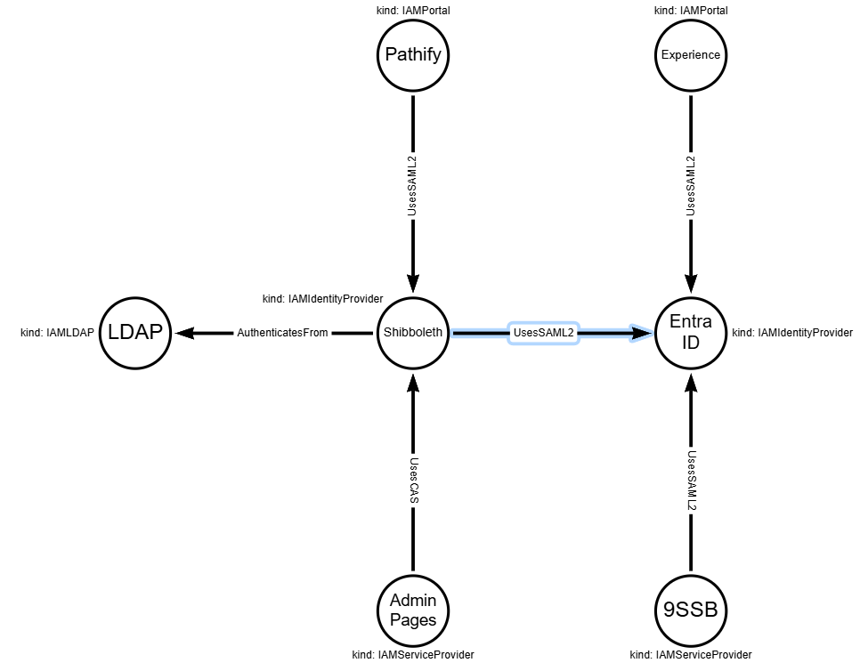
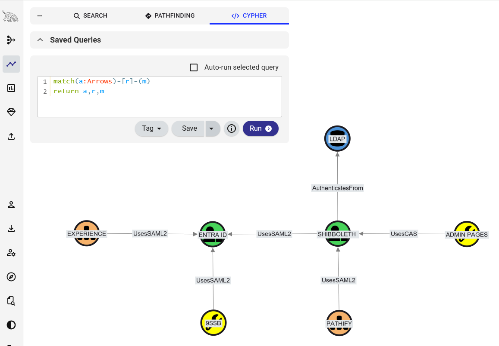

# DataHound: Arrows.app Collector
A specialized collector for BloodHound OpenGraph that enables operators to ingest data designed in [Arrows.app](https://arrows.app/).

This collector bridges the gap between conceptual or manual diagramming and automated graph analysis. It allows you to visualize and analyze things that standard collectors might miss, such as physical security bypasses, business processes, social engineering paths, or vendor dependencies—directly within BloodHound.

<table border="0">
  <tr>
    <td>
      
      <p align="center"><b>Arrows App</b><br/>Visualizing IAM architecture</p>
    </td>
    <td>
      
      <p align="center"><b>Organic Layout</b><br/>Visualizing IAM architecture</p>
    </td>
  </tr>
</table>

## Features
* **Conceptual Mapping:** Easily graph non-technical assets (e.g., physical keys, badge readers, social engineering targets).
* **Rapid Prototyping:** Sketch complex attack paths in Arrows.app and instantly load them into OpenGraph for analysis.
* **Node & Edge Support:** Extracts both Nodes (with properties like `kind` and `caption`) and Relationships (edges) from Arrows JSON.
* **Property Mapping:** Automatically maps Arrows properties to OpenGraph-compatible formats, replacing `null` values with strings for consistency.

## Usage
1. Create your diagram with [Arrows.app](https://arrows.app/), set a caption and define a kind property for each node, and set the type value for each edge. 
2. Export the diagram in JSON format by clicking 'Download/Export'.
3. Update the file path `source_path` in the [arrows-collection-definitions.json](arrows-collection-definitions.json) transformation defintion file.
4. Run DataHound to transform the diagram into an OpenGraph JSON
```
cmd> python .\DataHound.py --operation collect --config arrows-definitions.json --source-kind IAM --output sample-arrows-output.json
[INFO] Successfully read config from: arrows-definitions.json
[INFO] {"event": "ARROWS_LOAD_SUCCESS", "nodes_count": 7}
[INFO] Successfully processed Nodes
[INFO] Successfully added 7 items to nodes.
[INFO] {"event": "ARROWS_LOAD_SUCCESS", "edges_count": 6}
[INFO] Successfully processed Edges
[INFO] Successfully added 6 items to edges.
[INFO] Writing graph to output file: sample-arrows-output.json
[INFO] Successfully Wrote graph to sample-arrows-output.json
[INFO] Done.
cmd>
```
5. Upload the OpenGraph JSON `sample-arrows-output.json` to BloodHound and explore the graph using Cypher queries.
```
match(a:Arrows)-[r]-(m)
return a,r,m
```

## Custom Icons
You can easily enhance your graph display with custom icons.  
One way to accomplish this is to compile a CSV that can be transformed and then loaded with HoundTrainer.
The format for the file is:
`Kind Name,Icon Name,Color`
Below is an example showing how the IAM icon model was created for this Arrows example.
```
cmd> type ..\iam-model.csv
Kind Name,Icon Name,Color
IAMLDAP,database,#4D93D9
IAMDirectory,database,#4D93D9
IAMIdentityProvider,user-lock,#47D359
IAMServiceProvider,wrench,#FFFF00
IAMPortal,sitemap,#f6b26b
cmd>
```
Transform the CSV into the JSON format that BloodHound uses.
```
cmd> python .\houndtrainer.py create --type model --csv iam-model.csv --file iam-model.json
[INFO] Successfully wrote model from 'iam-model.csv' to file 'iam-model.json'.
[INFO] Done.
cmd>
```
Verify the output
```
cmd> type iam-model.json
{
    "custom_types": {
        "IAMLDAP": {
            "icon": {
                "type": "font-awesome",
                "name": "database",
                "color": "#4D93D9"
            }
        },
        "IAMDirectory": {
            "icon": {
                "type": "font-awesome",
                "name": "database",
                "color": "#4D93D9"
            }
        },
        "IAMIdentityProvider": {
            "icon": {
                "type": "font-awesome",
                "name": "user-lock",
                "color": "#47D359"
            }
        },
        "IAMServiceProvider": {
            "icon": {
                "type": "font-awesome",
                "name": "wrench",
                "color": "#FFFF00"
            }
        },
        "IAMPortal": {
            "icon": {
                "type": "font-awesome",
                "name": "sitemap",
                "color": "#f6b26b"
            }
        }
    }
}
cmd>
```
Upload the icon definitions to your installation (you will be prompted for a valid JWT)
```
cmd> python .\houndtrainer.py upload --type node --url https://bloodhound.local:8080 --file ..\iam-model.json
[INFO] Uploading model from file: iam-model.json...
Enter JWT:
[INFO] Operation 'upload' for type 'node' with file iam-model.json was successful.
[INFO] Done.
cmd>
```