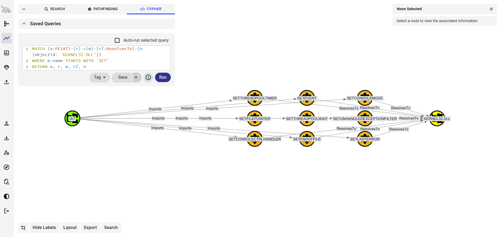
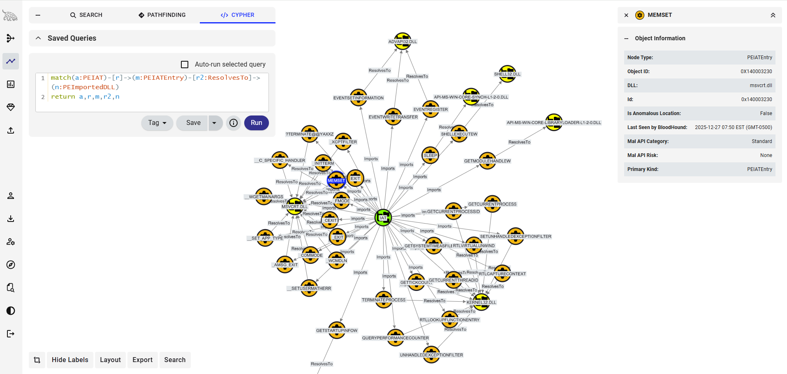

# Windows Portable Executable Collector

## Overview
The **Windows PE Collector** is a specialized parsing utility designed to decompose the structure of Windows binaries and reconstruct them as a directed graph. The output is a **BloodHound OpenGraph JSON** file.  
  
By representing PE structures as nodes and edges, security researchers can eliminate the cognitive overhead of multi-tool analysis, enabling graph-based queries to expose  patterns hidden within the relationship between sections and imports.

<p align="center">
  <br/>
  Mapping certutil.exe API calls to kernel32.dll
</p>

## Features
* **Metadata Extraction**: Comprehensive hashing (MD5, SHA1, SHA256) and version info parsing.
* **Structural Analysis**: Visualized, detailed breakdown of Sections, Imports (IAT), and Exports (EAT).
* **Malicious API Flagging**: Automatic identification of high-risk Windows APIs often used in malware.

### Offensive Research (Red Team)
* **Evasion Analysis:** Identify gaps in security product coverage by visualizing how packed sections or reflective loaders interact with system APIs.
* **Payload Optimization:** Model the "footprint" of a binary to minimize detection surface before deployment.
* **Primitive Discovery:** Identify paths to find new ways to "abuse" legitimate Windows features that haven't been documented yet.

### Defensive Research (Blue Team / DFIR)
* **Malware Triage:** Rapidly surface malicious intent by querying for high-risk API clusters (e.g., `VirtualAllocEx` + `WriteProcessMemory`).
* **Threat Hunting:** Pivot from a single malicious import to find all other samples in a dataset sharing the same unique `Imphash` or section characteristics.

## Core Graph Schema
The collector translates the PE file into the following entity relationship model:  
### Nodes
* **PEExecutable**: The root node (identified by SHA256). Contains file metadata, compiler timestamps, and hashes.
* **PEDLL**: The root node when parsing a DLL resource, (identified by SHA256). Contains file metadata, compiler timestamps, and hashes.
* **PESectionEntry**: Discrete memory segments (e.g., .text, .data). Includes entropy analysis to detect packed or encrypted code.
* **PEIAT**: An anchor node representing the Import Address Table as a logical unit.
* **PEIATEntry**: Individual function calls (e.g., VirtualAllocEx). Enriched with MalAPI risk scores.
* **PEImportedDLL**: The library providing the imported functions (e.g., KERNEL32.DLL).

### Edges
Configurable Graph Relationships (Edges) define how PE components interact within the graph. Using DataHound’s flexible architecture, you can modify these links to prioritize specific analytical paths. The default mapping follows the physical and logical structure of the binary:
* **PEExectuable** -[:HasSection]-> PESectionEntry: Maps the physical layout of the file.
* **PEDLL** -[:HasSection]-> PESectionEntry: Maps the physical layout of the file.
* **PESectionEntry** -[:ContainsElement]-> PEIAT: Identifies which section physically houses the Import Table.
* **PEIAT** -[:Imports]-> PEIATEntry: Links the table to its constituent function calls.
* **PEIATEntry** -[:ResolvesTo]-> PEImportedDLL: Maps the function to its parent library.

## Collection Modules
### 1. Metadata & Fingerprinting (`get_pe_metadata`)
Extracts the fundamental "identity" of the binary:
* **Hashes:** MD5, SHA1, SHA256.
* **Rich Headers:** Imphash (IAT fingerprint) and Exphash (EAT fingerprint).
* **Version Info:** Scrapes `StringFileInfo` for *Company Name*, *Original Filename*, and *Product Versions*.
---
### 2. Entropy & Section Analysis (`get_sections_dataframe`)
Calculates the **Shannon Entropy** for every section to detect obfuscation.
* **Core Metric:** High entropy in the `.text` section often indicates a packed binary or a hidden payload.
* **Functionality:** Provides a granular look at data density across all PE sections.
---
### 3. IAT & Malicious API Enrichment (`get_iat_with_malapi_dataframe`)
This module cross-references every imported function against a known risk map to identify suspicious behavior.
* **Anomalous Location Detection:** Flags if the IAT resides in an "Unmapped" region (outside of standard sections), a common sign of manual PE mapping or reflective loading.
* **Risk Categorization:** Tags functions with behavioral categories like *Injection*, *Anti-Debugging*, or *Persistence*.

### Collection Methods
| Function | Description |
|----|----|
| get_pe_metadata | Extracts primary file information including cryptographic hashes (MD5, SHA1, SHA256), magic bytes, compile time, and version information (Company Name, File Description, etc.). |
| get_sections_dataframe | Parses the PE section table to extract names, virtual addresses, raw sizes, and entropy levels. Returns a DataFrame joined with file metadata. |
| get_directory_section_info | A helper utility that identifies which physical section contains a specific Data Directory entry (e.g., Export or IAT directory). |
| find_eat_section | Locates the section containing the Export Address Table (EAT) and returns the section name and its Virtual Address. |
| find_iat_section | Locates the section containing the Import Address Table (IAT). Includes logic to handle cases where the IAT is unmapped or located in non-standard headers. |
| get_iat_dataframe | Parses the Import Address Table to list all imported DLLs and their associated functions, including their memory addresses and parent sections. |
| get_iat_with_malapi_dataframe | Enhances IAT data by cross-referencing imported functions against a known Malicious API map to identify high-risk behaviors like injection, evasion, or spyware. |
| get_exports_dataframe	| Extracts the list of symbols, ordinals, and memory addresses exported by the file; primarily used for analyzing DLLs and shared libraries.
| calculate_pe_risk_score | Generates a heuristic risk score (0-10) by evaluating telemetry points such as extension mismatches, suspicious API density, and known patterns. |

## Configuration
The collector uses a JSON configuration to define how specific PE data points map to **Graph properties** for both nodes and edges.
## Example: PE Exectuable
For a complete example, reviews the pe-testing-certutil.json file
**File Metadata Node**
```json
{
    "item_type": "node",
    "item_name": "File",
    "item_description": "Windows Portable Exectuable",
    "source_type": "pe",
    "source_path": "C:\\Windows\\System32\\certutil.exe",
    "id_location": "sha256",        
    "column_mapping": {  
        "filename": "name",
        "imphash": "IATHash"
    },		
    "output_columns": [            
        "id",
        "name",
        "sha256",
        "MagicHex",
        "IATHash",
        "machine",
        "compile_time",
        "entry_point"
    ],  
    "item_kind": "PEExectuable"
}
```
**Executable to Section Edge**
```json
{
    "item_type": "edge",
    "item_name": "PEExectuable -> PESectionEntry edge",
    "item_description": "PEExectuable -[:HasSection]-> PESectionEntry",       
    "edge_type": "static",		
    "edge_name": "HasSection",
    "source_type": "pe_sections",
    "source_path": "C:\\Windows\\System32\\certutil.exe",		
    "source_column": "sha256",
    "target_column": "section-guid",
    "source_node_type": "PEExectuable",
    "target_node_type": "PESectionEntry",
    "source_name": "file_system"
}
```
## Invocation
Running a ```collect``` operation for certutil.exe using the definitions from ```pe-testing-certutil.json``` and outputting the graph to ```pe-output-certutil.json```:
```cmd
$ python DataHound.py --operation collect --config examples\pe\pe-testing-certutil.json --source-kind PE --output pe-output-certutil.json
[INFO] Successfully read config from: pe-testing-certutil.json
[INFO] Successfully added 1 items to nodes.
[INFO] Successfully processed Sections
[INFO] Successfully added 8 items to nodes.
[INFO] Successfully processed IAT
[INFO] Successfully added 1 items to nodes.
[INFO] Successfully processed PESectionEntry -> PEIAT edge
[INFO] Successfully added 1 items to edges.
[INFO] Successfully processed IAT Entries
[INFO] Successfully added 747 items to nodes.
[INFO] Successfully processed PEIAT -> PEIATEntry edge
[INFO] Successfully added 747 items to edges.
[INFO] Successfully processed PEExectuable -> PESectionEntry edge
[INFO] Successfully added 8 items to edges.
[INFO] Successfully added 26 items to nodes.
[INFO] Successfully processed PEIATEntry -> PEImportedDLL edge
[INFO] Successfully added 747 items to edges.
[INFO] Writing graph to output file: pe-output-certutil.json
[INFO] Successfully Wrote graph to pe-output-certutil.json
[INFO] Done.
$
```
---
## Use Cases for Cypher Queries
Once loaded into BloodHound, you can run queries that simplify analysis by highlighting relationships.

* **Query 1: Find Process Injection "Trifecta"** Identify any binary that imports the three core functions required for remote thread injection:
```cypher
MATCH (f:PEExectuable)-[:HasSection]->(sec:PESectionEntry)-[:ContainsElement]->(iat:PEIAT)-[:Imports]->(e:PEIATEntry)
WHERE e.name IN ['VIRTUALALLOCEX', 'WRITEPROCESSMEMORY', 'CREATEREMOTETHREAD']
WITH f, count(e) as critical_count
WHERE critical_count = 3
RETURN f
```

* **Query 2: Identify API Calls to a Specific DLL** Find binaries that invoke APIs that resolve to a specific DLL.
```cypher
MATCH (a:PEIAT)-[r]->(m)-[r2:ResolvesTo]-(n {objectid: 'KERNEL32.DLL'})
WHERE m.name STARTS WITH 'SET'
RETURN a, r, m, r2, n
```

* **Query 3: Identify Anomalous IAT Placement** Find binaries where the Import Table is hidden in a non-standard section or unmapped memory:
```cypher
MATCH (s:PESectionEntry)-[:ContainsElement]->(iat:PEIAT)
WHERE iat.Is_Anomalous_Location = true OR iat.Parent_Section = "UNMAPPED"
RETURN s
```
## Screenshots
<p align="center">
  <br/>
  Mapping the IAT for calc.exe
</p>